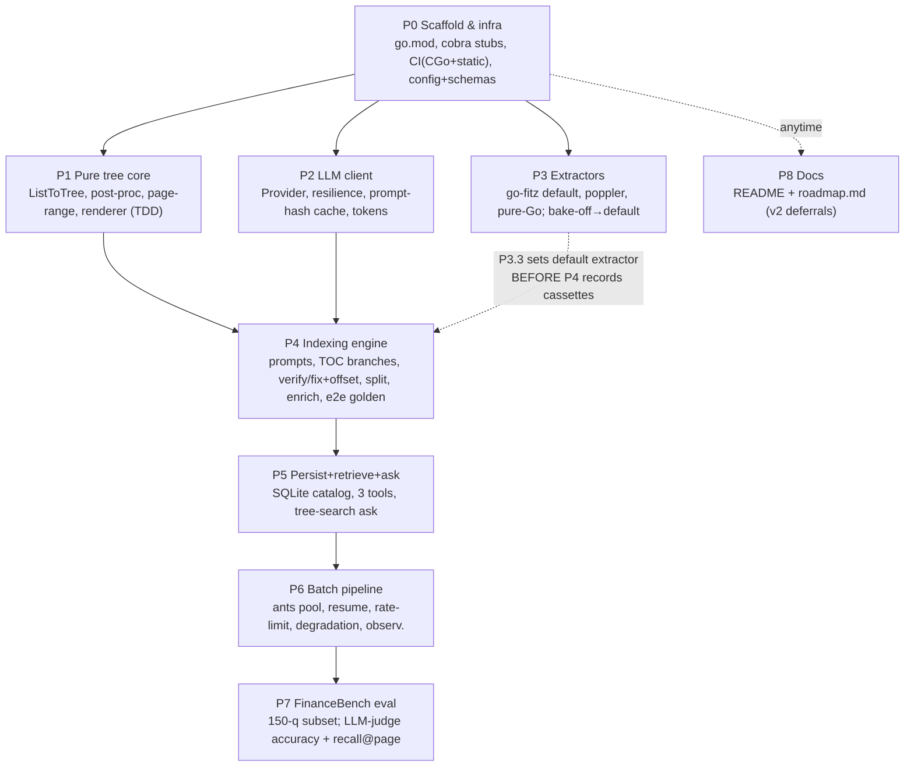

# pindex — a Go rewrite of PageIndex (vectorless, reasoning-based RAG)

## Context

PageIndex (VectifyAI, Python) builds hierarchical **tree** indexes from PDFs/Markdown and does
**vectorless** RAG — retrieval by LLM reasoning over document structure, no embeddings, no fixed
chunking, traceable page citations (published FinanceBench / Mafin 2.5: 98.7% answer accuracy).
We are rebuilding the engine in Go as **pindex**: a single-binary, low-memory, fast-startup,
CLI-first tool with clean concurrency orchestration and a robustness layer the Python original
lacks. This repo currently contains only `system_design/` (the design doc + Excalidraw diagrams)
and a Go-oriented `.gitignore` — there is **no source code yet**. This plan is the full v1 build.

**What the rewrite actually buys us (honest framing).** Indexing is **LLM-bound** (a 100-page PDF =
100–200 LLM calls); Go does not make the LLM faster. The verified state of the Python original
(see Reuse Map) is: LLM wrappers retry 10× on a fixed 1s sleep and **return `""` on exhaustion**
(silent failures), with **no backoff/jitter, no concurrency cap, no response cache, untyped config
(SimpleNamespace), and a single growing `_pindex.json` manifest**. pindex's value is therefore in
the engineering envelope around the same LLM work:
- **bounded concurrency + rate limiting** (don't get throttled/banned),
- **resumable indexing** (SQLite checkpoint — never re-index a completed doc after a crash),
- a **prompt-hash response cache** (`(model,prompt)→response`) that makes re-runs / crash recovery /
  eval iteration nearly free and doubles as the test mock seam,
- **degradation** (circuit-break a dead provider without draining the retry budget),
- a single binary an LLM can drive token-efficiently.
- *Caveat:* the default extractor (go-fitz/MuPDF) is CGo ⇒ the default release binary is
  platform-specific. A build tag swaps in the pure-Go `ledongthuc` extractor for a fully-static,
  cross-compilable build (quality traded for portability).

**North star:** simplicity until stable. Single-process for v1. The OSS PageIndex is
**index-only** (no `ask` primitive — you roll your own); pindex bakes in a clean iterative
tree-search `ask`. Defer corpus-scale File System / virtual nodes / Search-as-Code / TOON renderer
to v2 (`roadmap.md`).

---

## Locked decisions

| Topic | Decision |
|---|---|
| **PDF extraction** | Pluggable `Extractor` adapter; backend via config. **Default: go-fitz/MuPDF** (CGo, the Go equivalent of PyMuPDF — same engine). Adapters: poppler `pdftotext -layout`; pure-Go `ledongthuc/pdf` (zero-dep static fallback, also the build-tag path); vision-LLM (scanned/hard pages). A FinanceBench bake-off picks the default; users can switch. |
| **Eval metric** | **Primary (comparability):** LLM-judge answer accuracy mirroring Mafin 2.5 `check_answer_equivalence` (permissive: rounding/superset/semantic-equivalence) → directly comparable to 98.7%. **Secondary (engineering):** retrieval **recall@page** on the 150-q public subset. |
| **On-disk format** | **JSON canonical on disk** (incl. catalog) + a `Renderer` seam at the LLM boundary. TOON's ~58% token win only appears rendering one node's *children as a flat table*; nested tree/raw prose don't benefit. Ship JSON in v1; add TOON renderer + A/B in v2. |
| **v1 retrieval** | Simple iterative tree-search `ask` (single-doc + multi-doc-by-description routing). Defer corpus File System. |
| **Module path** | Proposed `github.com/jenningsfantini/pindex` (confirm at kickoff; non-blocking). |

---

## Architecture (module layout)

```
pindex/
  cmd/pindex/main.go            # cobra root: index | ask | eval | extract (debug)
  internal/
    config/    # typed Config struct, YAML load + schema validation (defaults mirror config.yaml)
    tree/      # PURE types + ops: TreeNode, ListToTree, post-processing, WriteNodeID,
               #   RemoveFields, page-range parser, JSON renderer  (heavy TDD, no LLM)
    prompts/   # the ~15 INLINE prompts extracted into templates + typed output schemas
    llm/       # Provider interface; openai + anthropic adapters; validate-then-retry structured
               #   output; resilience (backoff+jitter, circuit-breaker, rate-limit); prompt-hash
               #   cache; token counting; MockProvider/cassettes (same seam as the cache)
    extract/   # Extractor interface + adapters: mupdf(go-fitz, default), poppler, purego, vision
               #   NOTE: go-fitz cannot call Text() concurrently on the SAME doc handle —
               #   serialize page calls within a doc; parallelize ACROSS docs (see pipeline/)
    index/     # engine state machine: TOC detect -> 3 branches -> verify/fix -> page-offset ->
               #   list->tree -> large-node split -> enrich.  LLM steps thin; pure logic in tree/
    store/     # SQLite catalog (modernc.org/sqlite, pure-Go) + per-doc JSON blobs; atomic writes;
               #   resumable indexing checkpoint/job store
    retrieve/  # get_document, get_document_structure (text stripped), get_page_content
    ask/       # iterative tree-search agent loop -> grounded answer w/ page citations
    pipeline/  # bounded worker pool (ants) batch indexing; resume; rate-limited; degradation-aware
  eval/financebench/  # download -> index -> ask -> score (LLM-judge + recall@page)
  testdata/           # golden small PDF/MD, LLM cassettes
  README.md  roadmap.md
```

**Vetted libraries:** `spf13/cobra` (CLI); `openai-go` + `anthropic-sdk-go` behind a thin
`Provider`; `avast/retry-go` + `sony/gobreaker` + `golang.org/x/time/rate` (resilience);
`panjf2000/ants` (worker pool); `modernc.org/sqlite` (pure-Go catalog + cache);
`invopop/jsonschema` (struct→schema) + `santhosh-tekuri/jsonschema` (validate LLM output);
`pkoukk/tiktoken-go` (tokens); `gen2brain/go-fitz` (MuPDF). **No** Temporal/River/asynq in v1 —
keep the job-store/worker-pool *interfaces* clean so distribution can plug in later.

---

## Reuse map — what we port from PageIndex (VERIFIED against source)

Source = `github.com/VectifyAI/PageIndex/pageindex/` (also at the user's local
`/Users/jjfantini/github/PageIndex/pageindex/`). The engine is a deterministic state machine
around ~15 prompts. Port faithfully — quote and re-implement, don't reinvent.

> **Verified source-location corrections (the draft mis-filed these):**
> - `list_to_tree`, `post_processing` are in **`utils.py`**, *not* `page_index.py`.
> - `page_list_to_group_text` is in **`page_index.py`** (it exists — the draft filed it under utils).
> - There is **no `prompts.py`**. All ~15 prompts are **inline string templates** inside the
>   functions in `page_index.py`/`utils.py` and must be hand-extracted into `prompts/`.

| pindex target | PageIndex source (file:function) | Notes |
|---|---|---|
| `tree.ListToTree`, post-processing, node-id, field-strip | **`utils.py`**: `list_to_tree`, `post_processing(structure, end_physical_index)`, `write_node_id(data, node_id=0)`, `remove_fields(data, fields=['text'])` | **Pure → real red-green TDD.** These were Python's fragile spots; harden them. |
| page-range parse | `retrieve.py:_parse_pages(pages)` | Handles `"5-7"` / `"3,8"` / `"12"` → sorted, deduped int list. |
| `index/` state machine + 3 branches | `page_index.py`: `check_toc`, `find_toc_pages`, `toc_extractor`/`toc_transformer`/`toc_index_extractor`, `process_toc_with_page_numbers`, `process_toc_no_page_numbers`, `process_no_toc`, `meta_processor`, `tree_parser`, `page_index_main` | **Preserve the recursive fallback chain:** page-numbered → no-page → no-TOC. `meta_processor` runs `verify_toc`; 100%→accept, >60% w/ errors→`fix_incorrect_toc_with_retries`, low→degrade mode and recurse. |
| verify + fix | `page_index.py`: `verify_toc`, `check_title_appearance`(`_in_start`/`_concurrent`), `fix_incorrect_toc`, `fix_incorrect_toc_with_retries`, `single_toc_item_index_fixer` | Sampling verify; bounded fix retries (3). |
| **page-offset alignment** | `page_index.py`: `extract_matching_page_pairs`, `calculate_page_offset`, `add_page_offset_to_toc_json`, `validate_and_truncate_physical_indices` | **Critical for recall@page** (printed page label ≠ internal physical index). |
| large-node split | `page_index.py:process_large_node_recursively` | Add a **recursion-depth guard** (Python has none). |
| chunking util | `page_index.py:page_list_to_group_text` | Token-bounded grouping for no-TOC full-doc extraction. |
| enrich | `utils.py`: `generate_node_summary` (async), `generate_doc_description`, `write_node_id` | config-gated by `if_add_*`. |
| retrieval (3 tools) | `retrieve.py`: `get_document`, `get_document_structure` (strips text via `remove_fields(structure, fields=['text'])`), `get_page_content` | Port whole file incl. `_get_pdf_page_content`/`_get_md_page_content`. |
| `ask/` loop | `examples/agentic_vectorless_rag_demo.py` | Reference agent loop; we promote it to a first-class CLI command. |
| extraction | `utils.py:get_page_tokens(pdf_path, model, pdf_parser="PyPDF2")` | Our `Extractor` generalizes this → `(text, tokenCount)` per page. |
| LLM wrapper seam | `utils.py`: `llm_completion`, `llm_acompletion`, `count_tokens`; `ConfigLoader` | **Verified weakness to fix:** 10 retries × fixed 1s sleep, returns `""` on exhaustion, `temperature=0`, no backoff/cache, config = untyped SimpleNamespace. |

**Config defaults (VERIFIED — note the draft mis-stated summary/desc).** `model: gpt-4o-2024-11-20`,
`toc_check_page_num: 20`, `max_page_num_each_node: 10`, `max_token_num_each_node: 20000`,
`if_add_node_id: yes`, `if_add_node_summary: yes`, **`if_add_doc_description: no`**,
**`if_add_node_text: no`**. Mirror these defaults in `internal/config`.

**Prompt fidelity.** Port all ~15 inline prompts verbatim (toc_detector, toc transform/extract,
add_page_number_to_toc, generate_toc_init/continue, check_title_appearance(_in_start),
single_toc_item_index_fixer, generate_node_summary, generate_doc_description, the completeness
checks). **Keep the `{"thinking": ...}` CoT fields** — that field does accuracy work; use
**validate-then-retry structured output, NOT hard constrained-decoding**. Keep **`temperature=0`**
(index determinism + cache hits).

## Robustness improvements (deliberate divergences from PageIndex)

1. **No silent failures** — failed/unparseable LLM calls return typed errors, never `""`/`{}`.
2. **Real resilience** — exponential backoff + jitter, per-provider circuit-breaker, rate limiter,
   bounded retry budget (degradation ≠ retry-storm).
3. **Prompt-hash response cache** — `(model,prompt)→response`; same seam mocks LLMs in tests.
4. **Typed, validated config + schemas** (struct → JSON Schema → validate LLM output).
5. **Bounded concurrency** (worker pool/semaphore) instead of unbounded `asyncio.gather`.
6. **SQLite catalog**, not one growing `_pindex.json`; per-doc JSON blobs stay on disk
   (inspectable, git-friendly).
7. **Resumable indexing** — checkpoint store; skip completed docs on restart.
8. **Recursion-depth guard** on large-node split; **atomic** catalog writes.

---

## Phased PR plan (small PRs, each merges into `develop`)



> **The one hard coupling:** P4 cassettes embed extracted page text, so **P3.3 must fix the default
> extractor before P4 records cassettes** (re-record if it changes). Otherwise P1/P2/P3 fan
> out in parallel after P0; P5→P6→P7 are sequential; P8 anytime.

**P0 — Scaffold & infra**
- P0.1 repo scaffold (`go.mod`, cobra skeleton with stub `index/ask/eval`), GitHub Actions CI
  (build, `go vet`, `golangci-lint`, `go test`). **CI installs the C toolchain + MuPDF for
  CGo/go-fitz** *and* runs a separate static pure-Go build-tag job, so P3.1 doesn't redden CI on
  arrival. Create `develop` branch.
- P0.2 typed `config` (struct + YAML + validation) + core schema structs (TreeNode, Document,
  catalog entry) with struct→JSON-Schema + round-trip golden tests. Defaults mirror config.yaml
  (incl. the corrected `if_add_doc_description: no`, `if_add_node_text: no`).

**P1 — Pure tree core (heavy TDD, no LLM)**
- P1.1 `tree`: node types, `ListToTree` (numeric-hierarchy nesting), `post_processing`, node-id,
  field-strip (`RemoveFields`), page-range parser, JSON renderer — exhaustive unit tests.
- P1.2 *(optional/low-priority)* Markdown pure-parse path (header regex + stack nest + thinning),
  sharing tree-build. **Conscious call:** MD is *not* load-bearing for FinanceBench (PDF); ship the
  cheap pure-parse path or defer summaries — note in roadmap.

**P2 — LLM client + resilience + cache (the seam)**
- P2.1 `llm.Provider` interface; OpenAI + Anthropic adapters; structured output via JSON Schema with
  **validate-then-retry**; preserve CoT `{"thinking"}` fields; `temperature=0`.
- P2.2 resilience: retry-go + gobreaker + rate limiter; typed errors; degradation policy.
- P2.3 prompt-hash response cache (SQLite/disk) + `MockProvider`/cassettes for tests.
- P2.4 token counting (tiktoken-go) + chunking util (port `page_list_to_group_text`).

**P3 — Extractor adapters + bake-off**
- P3.1 `Extractor` interface + **go-fitz/MuPDF (default)** + pure-Go `ledongthuc` adapters
  (`(text, tokenCount)` per page; config-selectable). Pure-Go adapter doubles as the **static
  build-tag** path. **Serialize `Text()` within a doc handle** (go-fitz constraint).
- P3.2 poppler `pdftotext -layout` adapter. Vision-LLM adapter is an escape hatch — **deferrable to
  roadmap** for a tighter v1; the pluggable interface makes adding it later free.
- P3.3 FinanceBench 3-PDF **extraction bake-off** → table-page fidelity report → **set default**
  (gates P4 cassette recording).

**P4 — Indexing engine (port the state machine)**
- P4.1 `prompts` package — extract all ~15 inline prompts + typed schemas; cassette tests.
- P4.2 TOC detect + 3 branches (page-numbered / no-page / no-TOC) against cassettes; preserve the
  recursive fallback in `meta_processor`.
- P4.3 verify-by-sampling + fix-with-retries + **page-offset calc** + validate/truncate indices.
- P4.4 `list→tree` post-processing + recursive large-node split (**+ depth guard**) + enrichment
  (id/summary/desc, config-gated).
- P4.5 e2e single-PDF index → tree JSON; **golden small-doc test** in CI (cassette-backed).

**P5 — Persistence + retrieval + ask**
- P5.1 `store`: SQLite catalog + per-doc JSON blob; atomic writes; resumable checkpoint store.
- P5.2 `retrieve`: port `retrieve.py` (3 tools + page-range semantics, PDF + MD).
- P5.3 `ask`: iterative tree-search loop (description-routing across docs → tree walk → tight page
  fetch → grounded answer **with page citations**). CLI `pindex ask`.

**P6 — Batch pipeline + scale**
- P6.1 bounded worker-pool batch indexing (ants) with **resume** (skip completed via checkpoint),
  rate-limited, degradation-aware. **Parallelize across docs; serialize page extraction within a
  doc** (go-fitz handle constraint). CLI `pindex index <dir>`.
- P6.2 observability: structured logs, per-doc status, partial-failure report.

**P7 — FinanceBench eval harness**
- P7.1 fetch/prepare the **150-question public subset** (PDFs + questions + evidence pages).
- P7.2 index the subset into one store, `ask` each question in corpus-search mode, score:
  - **answer accuracy** via LLM-judge mirroring `check_answer_equivalence` → comparable to 98.7%;
  - **recall@page**: did fetched/cited pages include the gold evidence page, after physical-index
    ↔ printed-label alignment (**hand-verify 2–3 first**).
  - Report both + cost/query (cache makes re-runs cheap).

**P8 — Docs & examples**
- README (install, `index`/`ask`/`eval` usage), runnable examples, and **`roadmap.md`** (v2: corpus
  File System / virtual nodes / query-dependent corpus tree; Search-as-Code `ask`; TOON renderer
  A/B; full MD summaries; distributed job queue).

---

## Execution workflow

- **Branching:** create `develop` first. Every PR forks from `develop`, merges back into `develop`;
  reviewer handles `develop → main`.
- **TDD taxonomy:** (1) **pure functions** (tree ops, page-range, offset calc, renderers) → real
  red-green TDD; (2) **LLM-calling funcs** → cassette/MockProvider (deterministic, free, fast) —
  same seam as the response cache; (3) **e2e** → one golden doc in CI (cassette-backed). FinanceBench
  is a **paid run outside CI**. Minimal implementation to pass tests; keep the codebase tight.

---

## Verification (end-to-end)

1. **Unit/CI:** `go test ./...` green; `golangci-lint` clean; pure-logic packages near-100% covered;
   both CI jobs pass (CGo default build **and** static pure-Go build tag).
2. **Golden index:** `pindex index testdata/sample.pdf` reproduces the committed golden tree JSON.
   Determinism comes from the **frozen LLM cassette** (providers aren't byte-deterministic even at
   `temperature=0`); cassette text is extractor-specific, so it is pinned to the P3.3 default.
3. **ask smoke:** `pindex ask <doc> "..."` returns a grounded answer citing specific pages; open the
   cited pages and confirm they contain the evidence.
4. **Extraction bake-off (P3.3):** side-by-side fidelity on 3 FinanceBench table pages across
   adapters; default chosen on evidence in the report.
5. **FinanceBench (P7):** report LLM-judge answer accuracy (vs Mafin 2.5's 98.7%) **and** recall@page
   on the 150-q subset; hand-verify 2–3 page alignments before trusting the harness.
6. **Resilience:** inject 200-error/kill a provider mid-batch → circuit breaks, retry budget not
   drained, `pindex index` **resumes** without re-indexing completed docs; cache hits visible on
   re-run.
