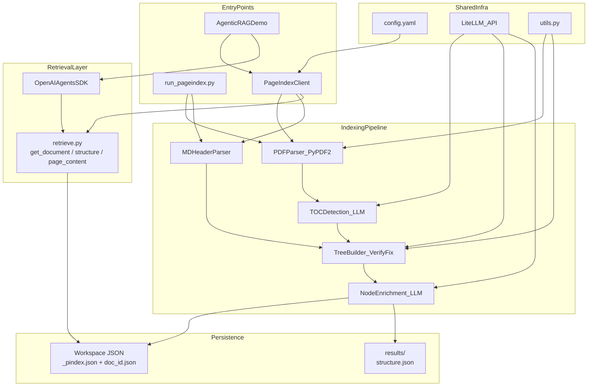
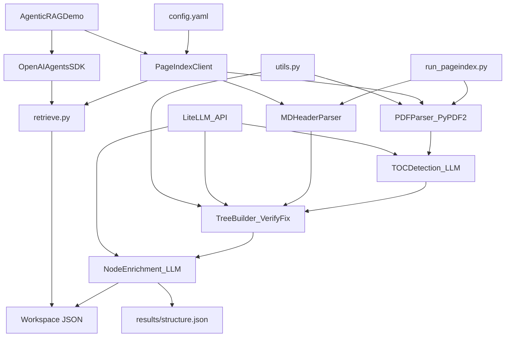
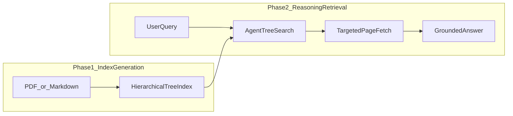
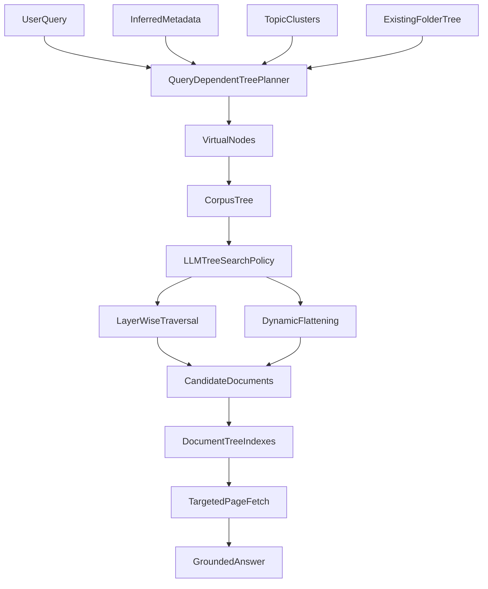

# PageIndex High-Level System Design

Vectorless, reasoning-based RAG for long documents. This document describes the **as-built open-source architecture** in [`/Users/jjfantini/github/PageIndex`](https://github.com/VectifyAI/PageIndex): a self-hosted Python library that builds hierarchical tree indexes from PDFs and Markdown, then supports agentic retrieval via LLM reasoning over that index.

**Scope:** OSS library (CLI + `PageIndexClient` + agent demo) plus the enterprise **PageIndex File System** concept from the PageIndex blog. The OSS repo is the single-document tree-index core. The File System is a corpus-scale layer above that core that lets one tree-search policy navigate millions of documents.

---

## Step 1: Requirements

### Functional

Users should be able to:

1. **Index documents** - Transform PDF or Markdown files into a hierarchical tree structure (TOC-like nodes with page or line ranges).
2. **Persist indexes** - Save indexed documents in a file-based workspace (`{doc_id}.json` + `_pindex.json`).
3. **Retrieve by structure** - Fetch document metadata, tree structure, and page/line content via a thin retrieval layer.
4. **Run agentic QA** - Ask questions over indexed documents using an LLM agent with tool-calling (OpenAI Agents SDK demo).
5. **Batch index via CLI** - Generate structure JSON from the command line without writing application code.
6. **Scale to corpus search** - For enterprise deployments, organize millions of document trees under a query-dependent file-system tree.

### Non-Functional

The system should be:

1. **Vectorless** - No vector database, no fixed chunking; retrieval is reasoning-based over document structure.
2. **Traceable** - Answers cite page/section references from the tree, not opaque similarity scores.
3. **LLM-cost aware** - Indexing is LLM-heavy (many calls per PDF); retrieval defers tree-search reasoning to the agent layer.
4. **Self-hosted and simple** - Single-process Python, file persistence, no queues or databases; only external dependency is LLM API keys via LiteLLM.
5. **Corpus-scale search path** - At enterprise scale, avoid forcing the LLM to inspect every document tree by adding a higher-level tree over the corpus.

---

## Step 2: Core Entities

| Entity | Description | Storage |
|--------|-------------|---------|
| **Document** | Indexed file (PDF or MD) with metadata, page text, and tree structure | `{doc_id}.json` in workspace |
| **TreeNode** | Section node: `title`, `node_id`, `start_index`/`end_index`, optional `summary`, nested `nodes` | Embedded in Document |
| **Workspace** | Collection of documents plus a lightweight index for lazy loading | `_pindex.json` + per-doc JSON files |
| **PageContent** | Extracted per-page text (PDF) or line-indexed content (MD) | Embedded in Document |
| **Config** | LLM model, TOC scan depth, node size limits, enrichment flags | `pageindex/config.yaml` |
| **CorpusTree** | Enterprise file-system tree that sits above document trees | PageIndex Enterprise / Cloud |
| **VirtualNode** | Query-relevant topic, metadata, or cluster node synthesized over the corpus | PageIndex File System |

**Example tree node (from README):**

```json
{
  "title": "Financial Stability",
  "node_id": "0006",
  "start_index": 21,
  "end_index": 22,
  "summary": "The Federal Reserve ...",
  "nodes": []
}
```

---

## Step 3: API / Interface Contract

### CLI

```text
python run_pageindex.py --pdf_path <path> [--model ...]  ->  ./results/{name}_structure.json
python run_pageindex.py --md_path <path>  [--model ...]  ->  ./results/{name}_structure.json
```

### PageIndexClient (library)

```text
index(file_path, mode="auto")              -> doc_id
get_document(doc_id)                       -> metadata JSON
get_document_structure(doc_id)             -> tree without text fields
get_page_content(doc_id, pages="5-7")      -> page/line text JSON
```

`pages` syntax: `"5-7"` (range), `"3,8"` (list), `"12"` (single).

### Agent tools (demo layer)

```text
get_document()              -> metadata
get_document_structure()    -> tree index (no text)
get_page_content(pages)     -> targeted page/line content
```

**Source files:** `pageindex/client.py`, `pageindex/retrieve.py`, `run_pageindex.py`

---

## Step 4: Data Flow

### Indexing Flow (PDF)

1. **Parse PDF** - Extract per-page text via PyPDF2 (`utils.get_page_tokens`).
2. **Detect TOC** - LLM scans first N pages for table-of-contents (`check_toc`, `find_toc_pages`).
3. **Branch on TOC quality:**
   - TOC with page numbers -> `process_toc_with_page_numbers`
   - TOC without page numbers -> `process_toc_no_page_numbers`
   - No TOC -> `process_no_toc` (full-doc LLM extraction in token-bounded chunks)
4. **Verify and fix** - Sample titles against pages (`verify_toc`); retry with `fix_incorrect_toc_with_retries` on low accuracy.
5. **Build tree** - Flat list to nested structure (`list_to_tree`, `post_processing`) with `start_index`/`end_index`.
6. **Re-index large nodes** - Recursively split oversized sections (`process_large_node_recursively`).
7. **Enrich** - Add node IDs, summaries, optional inline text, doc description (config-driven).
8. **Persist** - Write to workspace (`PageIndexClient`) or `./results/` (CLI).

**Entry:** `page_index_main()` -> `tree_parser()` -> `meta_processor()` in `pageindex/page_index.py`

### Indexing Flow (Markdown)

1. Parse `#` headers (skip code blocks).
2. Build flat node list with line numbers.
3. Nest via stack into tree structure.
4. Optional tree thinning for small sections (`tree_thinning_for_index`).
5. Async LLM summaries per node.
6. Persist to workspace or results.

**Entry:** `md_to_tree()` in `pageindex/page_index_md.py`

### Retrieval Flow (Agentic QA)

1. User submits a natural-language query.
2. **Agent** (OpenAI Agents SDK) receives query + system prompt.
3. Agent calls `get_document()` to confirm status and page/line count.
4. Agent calls `get_document_structure()` to reason over the tree and identify relevant sections.
5. Agent calls `get_page_content(pages="X-Y")` with tight page ranges (never whole document).
6. Agent synthesizes answer from tool output only.

**Entry:** `examples/agentic_vectorless_rag_demo.py`

### Corpus Retrieval Flow (PageIndex File System)

The PageIndex File System generalizes the same tree-search policy from one document to a full corpus:

1. User submits a query across many documents.
2. PageIndex builds or selects a **query-dependent corpus tree** using folder structure, inferred metadata, topic clusters, and document summaries.
3. The LLM evaluates corpus-level nodes first: vendor, region, year, topic, status, entity, or other virtual groupings.
4. For informative branches, the search continues layer by layer.
5. For uninformative branches, the system dynamically flattens the subtree and jumps closer to leaves/documents.
6. Once candidate documents are selected, retrieval descends into the normal document tree and fetches targeted page/content ranges.

---

## Step 5: High-Level Design

### Component Map

| Component | File | Role |
|-----------|------|------|
| CLI | `run_pageindex.py` | Batch index PDF/MD to `./results/` |
| PageIndexClient | `pageindex/client.py` | Orchestrates index + workspace persistence + retrieval |
| PDF pipeline | `pageindex/page_index.py` | TOC detect, tree build, verify/fix, enrichment |
| MD pipeline | `pageindex/page_index_md.py` | Header parse, tree build, thinning, summaries |
| Retrieval tools | `pageindex/retrieve.py` | `get_document`, `get_document_structure`, `get_page_content` |
| Shared infra | `pageindex/utils.py` | LiteLLM calls, PDF parse, tree ops, ConfigLoader |
| Config | `pageindex/config.yaml` | Default model and indexing parameters |
| Agent demo | `examples/agentic_vectorless_rag_demo.py` | Full agentic RAG loop with OpenAI Agents SDK |
| PageIndex File System | Enterprise / Cloud | Query-dependent corpus tree over millions of document trees |
| Virtual nodes | Enterprise / Cloud | Synthesized topic, metadata, entity, and cluster nodes for corpus pruning |

### System Diagram (Primary)

Copy the Mermaid block below into Excalidraw (see import instructions at the end).



### System Diagram (Flattened Fallback)

Use this if Excalidraw renders subgraphs poorly.



### Two-Phase Model

PageIndex separates **index generation** from **retrieval**:



### Corpus-Scale File System Diagram

This is the enterprise layer described in the PageIndex File System blog. It does not replace the OSS document indexer. It sits above document trees and decides which document trees are worth opening for a query.



---

## Step 6: Deep Dives

### Scaling Indexing

- Each PDF triggers dozens of LLM calls (TOC detect, transform, verify, summarize, large-node recursion).
- Concurrency: `asyncio` for async LLM calls; `ThreadPoolExecutor` for nested event loops in sync contexts.
- Cost knobs in `config.yaml`: `max_token_num_each_node`, `max_page_num_each_node`, `toc_check_page_num`.

### Multi-Document Search

- In-repo: single workspace with multiple `{doc_id}.json` files; agent picks doc by ID.
- Tutorials (`examples/tutorials/doc-search/`) suggest external SQL for metadata search and description-based routing at corpus scale - not implemented in this repo.

### PageIndex File System

The PageIndex File System is the enterprise-scale answer to this problem: a single document tree works well for a 100-page report, but a million-document corpus cannot be searched by asking an LLM to inspect every document tree. The file-system layer makes the **corpus itself** searchable as a tree.

The key idea is simple:

```text
CorpusTree -> Folder_or_VirtualNode -> DocumentTree -> SectionTree -> PageContent
```

Instead of treating every document as a top-level candidate, PageIndex adds a corpus-level tree above the existing document indexes. The same LLM tree-search policy first decides which corpus branches to open, then descends into the selected document trees.

#### Why Plain Folders Are Not Enough

The blog calls out three failure modes that show up at enterprise scale:

1. **Flat corpora** - Documents often live in S3, SharePoint, or document management systems with metadata rows but no useful folder hierarchy.
2. **One-dimensional folders** - A contract can belong to vendor, region, fiscal year, product line, and renewal status at the same time. One folder tree forces exactly one axis.
3. **Bad labels** - Folders like `misc/`, `final_v3_USE_THIS_ONE/`, or `2019_legacy/` give the LLM weak pruning signals.

#### Virtual Nodes

When the inherited folder tree is not useful, PageIndex synthesizes structure:

- Topic nodes from clustering or LLM grouping.
- Metadata nodes from inferred category, summary, key entities, dates, vendors, regions, product lines, and status.
- Multi-parent placement so one document can sit under several virtual ancestors.

This is the major difference from a normal file system. A document can be reachable through multiple meaningful routes:

```text
Vendor -> Acme -> 2024 -> contract.pdf
Region -> EU -> vendor_contracts -> contract.pdf
RenewalStatus -> RenewalNextQuarter -> contract.pdf
```

#### Query-Dependent Tree Construction

A fixed tree is still wrong for many questions. The useful hierarchy depends on the query:

- `What did vendor X charge in 2024?` wants vendor first, then year.
- `Which contracts renew next quarter?` wants renewal status first, then date.

The PageIndex File System builds the corpus view on demand, conditioned on the query. It chooses which metadata axes and topic clusters become internal nodes for this query, without re-ingesting or re-embedding the corpus.

#### Adaptive Traversal

Tree search chooses a traversal strategy per node:

- **Layer-wise traversal** - Use when child labels are informative, such as `contracts/2024/vendor_X`.
- **Recursive flattening** - Use when intermediate labels are weak. Collapse unhelpful subtrees and compare closer-to-leaf document/content signals instead.

This prevents the LLM from wasting calls on meaningless directory depth. The search only pays for structure that actually helps prune the answer path.

### Cloud Extension (Separate Deployment Tier)

| Capability | OSS Repo | Cloud (pageindex.ai) |
|------------|----------|----------------------|
| PDF parsing | PyPDF2 (basic) | Enhanced OCR pipeline |
| Retrieval | Agent prompts + 3 tools | MCTS / tree search, hosted API |
| Interface | Library / CLI | Chat UI, MCP, REST API |
| Scale | Single workspace | PageIndex File System for millions of docs |
| Corpus structure | `_pindex.json` plus per-document JSON | Query-dependent corpus tree with virtual nodes |
| Deployment | Local Python process | Enterprise, dedicated, VPC, Cloud |

### Workspace Persistence Format

```
workspace/
  _pindex.json              # lightweight index: doc_id, name, path, type
  {doc_id}.json           # full record: structure, pages, metadata
```

Lazy loading: `_pindex.json` loaded at startup; full doc JSON loaded on first access.

---

## Import into Excalidraw

1. Open Excalidraw.
2. Click **Insert** -> **Mermaid** (or use the Mermaid paste dialog).
3. Copy the **Primary**, **Flattened Fallback**, or **Corpus-Scale File System** diagram block above without the opening and closing code-fence lines.
4. Adjust layout after import; the flattened diagram often auto-layouts more cleanly.

**Tips:**
- Node IDs use underscores, no spaces (Excalidraw-friendly).
- `flowchart TB` gives top-down layout.
- If labels truncate, double-click nodes in Excalidraw to edit text.

---

## Source References

| Path | Purpose |
|------|---------|
| `/Users/jjfantini/github/PageIndex/README.md` | Product vision, tree JSON example, install/usage |
| `/Users/jjfantini/github/PageIndex/pageindex/page_index.py` | PDF indexing pipeline |
| `/Users/jjfantini/github/PageIndex/pageindex/page_index_md.py` | Markdown indexing |
| `/Users/jjfantini/github/PageIndex/pageindex/client.py` | PageIndexClient API |
| `/Users/jjfantini/github/PageIndex/pageindex/retrieve.py` | Retrieval tool functions |
| `/Users/jjfantini/github/PageIndex/pageindex/utils.py` | LiteLLM, PDF, tree utilities |
| `/Users/jjfantini/github/PageIndex/pageindex/config.yaml` | Default configuration |
| `/Users/jjfantini/github/PageIndex/run_pageindex.py` | CLI entry point |
| `/Users/jjfantini/github/PageIndex/examples/agentic_vectorless_rag_demo.py` | Agentic RAG demo |
| `https://pageindex.ai/blog/pageindex-filesystem` | PageIndex File System, virtual nodes, query-dependent corpus tree |
