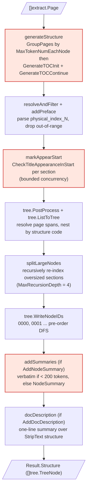
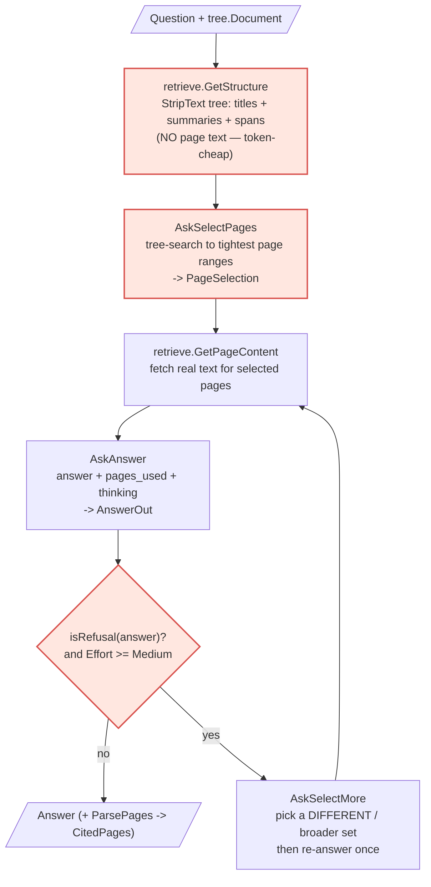
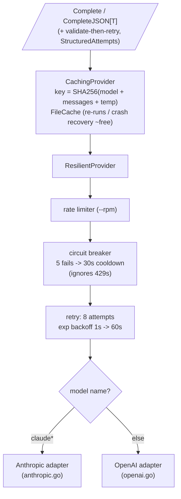

# pindex — System Design (layered)

> The **as-built** architecture of *this* Go repo (`github.com/jjfantini/pindex`) — our names, our packages.
> A vectorless reasoning-RAG engine: build a hierarchical **tree index** from a PDF, then answer
> questions by reasoning over that tree and citing the exact pages used.

This doc is laid out like an HNSW in reverse: **L0** is the high-level map; **L1.x** zooms into one
L0 component, named the same as the L0 node. The intent is to make it obvious **where answer accuracy
is won or lost** — see [Accuracy hot-spots](#accuracy-hot-spots) at the end.

Two phases, sharing one **Store** and one **LLM Provider Stack**:

- **INDEX** (offline): `PDF → Extract → Index Engine → Store` — build the tree once.
- **ASK** (online): `Question + Store → Retrieve → Asker → answer + cited pages`.

---

## L0 — System Overview

```mermaid
flowchart LR
    PDF[/"PDF file(s)"/]
    Q[/"Question"/]
    ANS[/"Grounded answer<br/>+ cited pages"/]

    subgraph INDEX["INDEX phase — build the tree (offline)"]
      direction TB
      EX["Extract<br/>PDF pages to text"]
      IE["Index Engine<br/>pages to hierarchical tree"]
      EX --> IE
    end

    subgraph ASKP["ASK phase — answer from the tree (online)"]
      direction TB
      RET["Retrieve<br/>3 tools over a stored doc"]
      ASK["Asker<br/>tree-search then answer"]
      ASK -->|"drives"| RET
      RET -->|"structure / page text"| ASK
    end

    ST["Store<br/>catalog.db + docs/&#123;id&#125;.json"]
    LLMS["LLM Provider Stack<br/>OpenAI / Anthropic<br/>+ cache + resilience"]

    PDF --> EX
    IE -->|"Save"| ST
    ST -->|"Load doc"| RET
    Q --> ASK
    ASK --> ANS

    IE -. "structure + enrich calls" .-> LLMS
    ASK -. "select-pages + answer calls" .-> LLMS

    classDef infra fill:#f3f0fa,stroke:#8a6fbf,stroke-width:1px;
    class ST,LLMS infra
```

**CLI surface** (`cmd/pindex/`, cobra): `index` (one PDF or a directory) · `ask` · `eval` (FinanceBench
harness, reuses `Asker`) · `extract` (debug: extraction only). The `index` command runs through
`pipeline.FileIndexer`; everything LLM-bound flows through the one provider stack.

---

## L1.Extract

`internal/extract/` — pluggable `Extractor` seam. Portability is a **runtime choice**, not a build tag.

```mermaid
flowchart TB
    PDF[/"PDF path"/]
    NEW["extract.New(cfg.Extractor)"]
    MU["mupdf<br/>go-fitz / MuPDF (cgo, default)<br/>serialize Text() per doc handle"]
    PG["purego<br/>ledongthuc/pdf (CGO_ENABLED=0)"]
    PO["poppler<br/>pdftotext -layout (external bin)"]
    OUT[/"[]extract.Page &#123;Index, Text&#125;"/]

    PDF --> NEW
    NEW -->|"mupdf"| MU --> OUT
    NEW -->|"purego"| PG --> OUT
    NEW -->|"poppler"| PO --> OUT

    classDef crit fill:#ffe7e0,stroke:#d9534f,stroke-width:2px;
    class MU,PG crit
```

> **Accuracy:** garbage in, garbage out. `purego` is the most portable but the weakest extractor;
> garbled or mis-ordered text here silently corrupts every downstream stage.

---

## L1.Index Engine

`internal/index/` — `Builder.Build(ctx, pages) → Result{Structure, Description}` (`engine.go`,
enrichment in `enrich.go`). This is the **no-TOC path**: the LLM *generates* structure from the page
text rather than detecting an existing table of contents.

> **Accuracy levers:** `generateStructure` decides the section boundaries (token grouping +
> init/continue can drift across group seams); `markAppearStart` fixes the start page of each section
> (wrong here = wrong page spans); `addSummaries` produces the text the **Asker actually reasons over**
> (see L1.Asker) — if summaries are off, retrieval sees titles only.

---

## L1.Asker  (drives L1.Retrieve)

`internal/ask/` — `Asker.Ask(ctx, doc, question) → Answer{Text, CitedPages, SelectedPages, Reasoning}`.
Two LLM steps: **select pages** over the structure, then **answer** strictly from the fetched text.

> **Effort dial** (`--effort`): `low` = single pass (default). `medium` adds the refusal-driven
> re-select loop above. **`high` / `ultra` currently behave like `medium`** — the true agentic loop is
> reserved for a later phase. Refusal detection is a heuristic substring match (`isRefusal`), so a
> phrasing it doesn't recognize won't trigger the recovery retry.

---

## L1.Retrieve

`internal/retrieve/` — the 3 read tools over a stored `tree.Document`. Pure functions, no LLM.

```mermaid
flowchart LR
    DOC[/"tree.Document"/]
    GD["GetDocument<br/>metadata: id, name, description, type, page_count"]
    GS["GetStructure<br/>StripText -> JSON (titles+summaries+spans)"]
    GP["GetPageContent<br/>ParsePages selector -> [&#123;page, content&#125;]"]
    DOC --> GD
    DOC --> GS
    DOC --> GP
```

> `GetStructure` keeps `Summary` but clears `Text` — this exact JSON is what `AskSelectPages` sees.
> `GetPageContent` accepts the `"5-7,12"` selector and silently skips pages not present.

---

## L1.LLM Provider Stack

`internal/llm/` — the `Provider` seam plus the resilience/cost envelope (the real value-add of the
rewrite). Composed outside-in: **cache → resilient → HTTP adapter**.

> Provider is routed purely by **model name** (`claude*` → Anthropic, else OpenAI). Keys come from a
> gitignored `.env` (which **overrides** the process env), loaded by `internal/envfile`. No vendor SDKs
> — hand-rolled HTTP. A `MockProvider` (`mock.go`) backs deterministic tests at the same seam.

---

## L1.Store

`internal/store/` — SQLite catalog + per-doc JSON blobs. Pure-Go (`modernc.org/sqlite`, no cgo).

```mermaid
flowchart TB
    DOC[/"tree.Document"/]
    SAVE["Store.Save"]
    CAT["catalog.db (SQLite)<br/>id, doc_name, type, path,<br/>page_count, indexed_at"]
    BLOB["docs/&#123;DocID&#125;.json<br/>full Document blob<br/>atomic temp + rename"]
    HAS{"Store.Has(DocID)?"}
    SKIP["skip — already indexed (resume)"]
    LOAD["Store.Load -> tree.Document<br/>(feeds the ASK phase)"]

    DOC --> SAVE --> CAT
    SAVE --> BLOB
    HAS -->|"yes (no --force)"| SKIP
    HAS -->|"no"| DOC
    BLOB --> LOAD
```

> Default workspace: `.pindex/workspace/`. `Store.Has` is the **resume checkpoint** — batch indexing
> never re-indexes a finished doc. Catalog rows enable lazy loading; the heavy structure+pages live in
> the per-doc JSON.

---

## Batch & Eval (orchestration, not new logic)

- `internal/pipeline/` — `FileIndexer.IndexOne` / `BatchIndex`: `FindPDFs` → per-doc
  `Extract → Builder.Build → assembleDoc → Store.Save`. Bounded concurrency via `errgroup.SetLimit`;
  one doc's failure never aborts the batch; `Store.Has` skips finished docs.
- `eval` (`cmd/pindex/eval.go`) — runs the FinanceBench set through the **same** `Asker.Ask`, then
  grades each answer with `JudgeEquivalence` (a judge model). This is the loop to watch when measuring
  whether the accuracy levers below actually move the score.

---

## Accuracy hot-spots

Where to look first when answers are worse than expected — ordered roughly upstream → downstream
(an upstream defect poisons everything after it). Highlighted in red in the L1 diagrams.

| # | Stage (component · function) | Failure mode | Lever |
|---|------------------------------|--------------|-------|
| 1 | **Extract** · `extract.New` backend | garbled / mis-ordered page text | use `mupdf`; treat `purego` output as suspect |
| 2 | **Index Engine** · `generateStructure` (`GenerateTOCInit/Continue`) | wrong/merged section boundaries; drift across token-group seams | `MaxTokenNumEachNode` group size; structure prompts |
| 3 | **Index Engine** · `markAppearStart` (`CheckTitleAppearanceInStart`) | section assigned the wrong start page → wrong spans | the appearance-check prompt; verify/fix pass (not yet built) |
| 4 | **Index Engine** · `splitLargeNodes` | sections too coarse → page ranges too wide to be precise | `MaxPageNumEachNode`, `MaxRecursionDepth` |
| 5 | **Index Engine** · `addSummaries` (`AddNodeSummary`) | summaries off/weak → Asker reasons over **titles only** | turn on `AddNodeSummary`; improve `NodeSummary` |
| 6 | **Asker** · `AskSelectPages` over `GetStructure` | picks wrong/too-narrow pages → refusal or wrong answer | the select-pages prompt; the recovery loop below |
| 7 | **Asker** · refusal recovery | only fires at `Effort >= Medium`; `high`/`ultra` == `medium`; `isRefusal` is substring-matched | raise `--effort`; build the real agentic loop; harden `isRefusal` |
| 8 | **Asker** · `AskAnswer` | grounded but mis-synthesized answer / bad `pages_used` | the answer prompt; stronger model |

> **Two highest-leverage, cheapest checks:** (5) confirm `AddNodeSummary` is on — otherwise step 6 is
> flying on titles alone; and (7) remember the default `low` effort is single-pass with **no** recovery,
> and `high`/`ultra` don't yet do more than `medium`.
